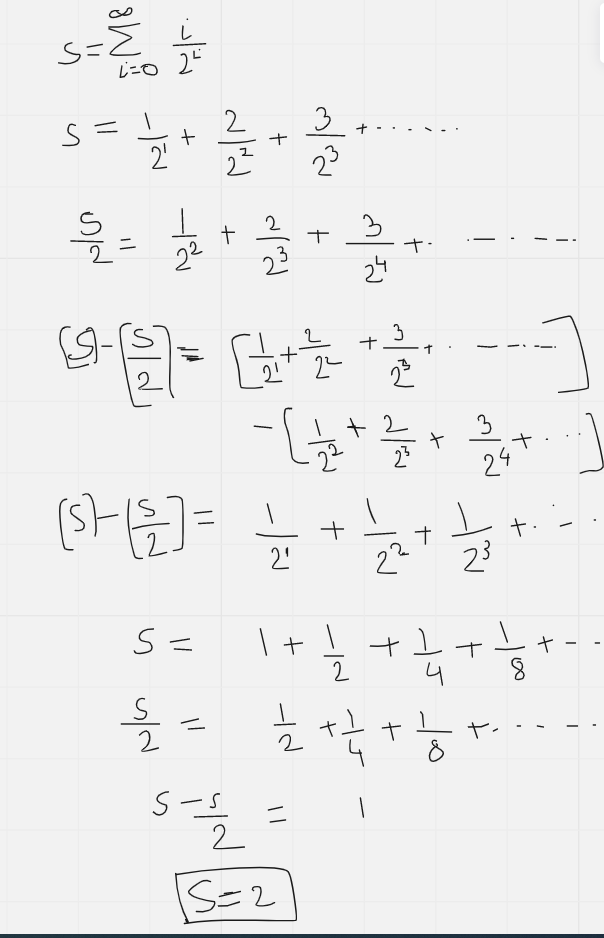

# Basic mathematics
Some basic mathematics to be known to derive the complexity of the algorithms etc.  

## Sum of first 'n' numbers
S = 0 + 1 + 2 + ..... + (n-1) 
S = (n-1) + (n-2) + (n-2) + ..... + 0
2S = 0 + n + n + n + ...... + 0   
*....n is counted (n-1) times* 
2S = n(n-1) 
**S = n(n-1)/2 **

## Arithmetico-Geometric Series
As per [Wikipedia definition](https://en.wikipedia.org/wiki/Arithmetico-geometric_sequence), *arithmetico-geometric sequence is the result of term-by-term multiplication of a geometric progression with the corresponding terms of an arithmetic progression.*

For example, below is one of the demonstration of arithemtico-geometric series and solution.

