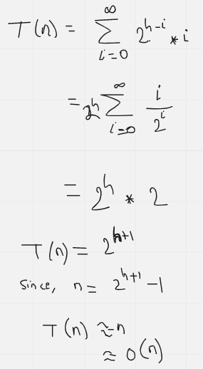

# Time and Space complexity
The time and space complexity for all sorting algorithms (with comparison) is very well explained here (one of the best resource I found so far)  https://www.interviewkickstart.com/learn/time-complexities-of-all-sorting-algorithms

Some of the notes - 

## Merge sort time complexity derivation

1. The list keeps get dividing recursively in 2 halves. It thus resembles a complete binary tree in the stack space.
2.  Let 'n' be number of nodes (a.k.a numbers) and 'h' be the height of this tree. All the leaf nodes will amount for 'n'. 
    2h=n 
    h*log22=log2(n) 
    h=log2(n)
3. Total amount of work done in the tree is the time complexity of algorithm. At each level of the tree, the total amount of work done is roughly the size 'c*n'. ('c' being some system dependent constant)   
Hence, the total work done = cn * h = cn * log2n
4. The asymptotic time complexity = O (nlog2n)

*Note - The best, average and worst time complexity for merge sort is the same as you keep on dividing the array into halves and then merge - which is irrespective of nature of the inputs*

## Quick sort time complexity derivation
1. This is similar to Merge complexity derivation above.
2. For best and average cases, it will continue to remain O (nlog2n). This assumes there is a high probability you are picking up the pivot as the median (best case) or almost the median (average case) all the time recursively.
3. However, for worst case, if the pivot is recursively picked up as the smallest or largest element of the array, the tree will be completely skewed either to the left (if largest pivot) or the right (if smallest pivot). Hence, the height of the tree (h) would be equal to number of nodes (n).  
   Given above, h = n  
   Time complexity = O (n * h) = O (n * n) = O (n2)

## Heap sort time complexity derivation
1. The heapifying procedure logically looks like similar to the tree which is being shown in Merge sort above. Note, this will be a complete binary tree (may not be a full binary tree). However, for complete binary tree, the total number of nodes (n) in the tree of height (h) 
   n = 20 + 21 + 22+....+2h 
   2n = 21 + 22+....+2h-1+2h+2h+1 
   2n - n = 2h+1-1 
   n = 2h+1-1 
2. Time complexity of heap sort = Time complexity of *building heap* * Time complexity of *extract-max* operation for each element (n) (assuming max heap). 
   1. Building the heap time complexity
      1. Now, at the each node of the tree, we find out amount of work done or time spent. 
      2. For leaf nodes at height (h) i.e. 2h no work is done or time spent. So time complexity here is - 2h * 0.
      3. Similarly for penultimate level, 2h-1 nodes check for atmost 1 level down at the bottom to satisfy max heap property. Hence, total work done here is 2h-1 * 1.  
      4. Generalizing above, total work done or time complexity is 
   T(n) = (2h*0) + (2h-1*1) +  (2h-2*2) + .. (2h-i*i) + .... + (1 * 2h) 
   Solving, this we get below time complexity for building the heap. 
   *Note - Refer [arithmetico-geometric series solution](mathematics.md#arithmetico-geometric-series) which is used in below* 
    
   2. Time complexity of *extract-max* operation on the max-heap is O(1) since it just get the root element. Hence, for getting for all nodes it will be O(n).

3. Hence, the total complexity of the heap sort 
   T(n) = O(log2n) * O(n) 
   T(n) = O(nlog2n)

   
    

